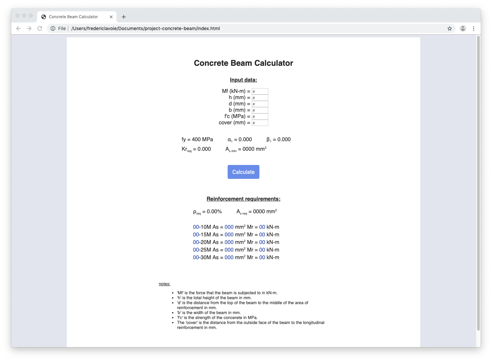
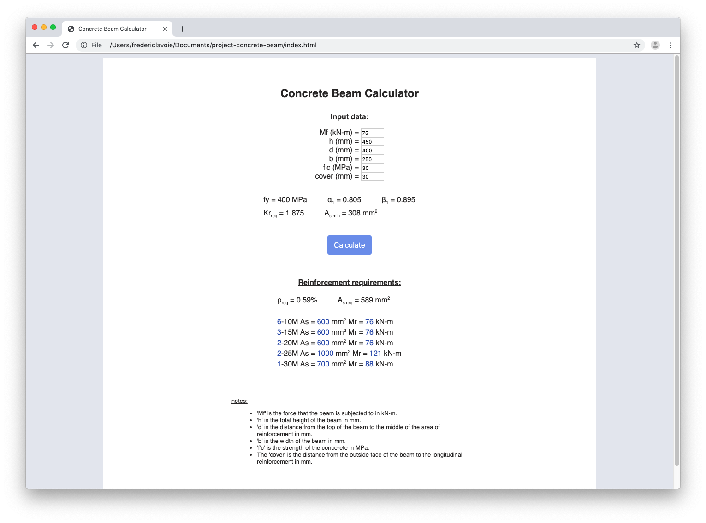

# Project: Concrete Beam
This simple webpage calculates the required number of rebar and the spacing based on the
rebar size chosen. The user inputs the moment capacity required, the geometry of the beam
and the strength of the concrete.

Click on the following link to try out this app:

https://fredlavoie.dev/project-concrete-beam

Disclaimer: this website and its content is for demonstration purposes only and is not
intended to constitute, in whole or in part, engineering judgement or advice. This webpage
is not to be used for engineering design calculations.

## Screenshots

### Empty form:

### Filled form:

